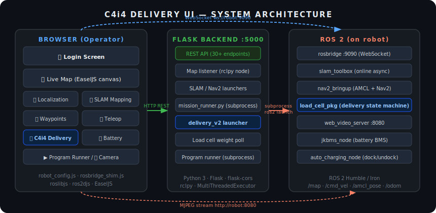
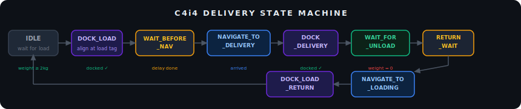

# ROBOMUSE_UI--AMR-UI-For-C4I4
# 🤖 UI for C4I4 — AMR Web Control Dashboard

> **SVR Robotics · RoboMuse Control System**  
> A browser-based operator interface for Autonomous Mobile Robots running **ROS 2 + Nav2**, with a fully autonomous load-cell-triggered delivery pipeline.


---

## 📸 System Architecture



---

## ✨ Feature Overview

| Tab | Feature | Description |
|-----|---------|-------------|
| 🏠 **Home** | Dashboard | ROS connection status, battery, weight, quick-nav buttons |
| 🗺 **Mapping** | SLAM | Start/stop `slam_toolbox`, live map canvas, save/discard map |
| 📍 **Localization** | AMCL + Nav2 | Load saved map, click-to-set 2D pose estimate, click-to-navigate goal |
| 🛣 **Mission** | Waypoint Missions | Place waypoints on map, per-waypoint delays, drag-to-reorder, loop runner |
| 🚚 **C4i4 Delivery** | Autonomous Delivery | Load-cell + AprilTag state machine: detect load → dock → navigate → deliver → return |
| 🕹 **Teleop** | Manual Control | D-pad buttons + WASD/arrow keyboard, adjustable speed sliders, 10 Hz watchdog |
| 🔋 **Battery** | JK BMS Monitor | SOC%, current (A), 5-min rolling runtime estimate, temperature |
| 📷 **Camera** | Live Feed | MJPEG stream from `web_video_server` |
| ⚙ **Custom App** | Program Runner | List and launch custom Python scripts from the `programs/` folder |
| 🔌 **Dock/Undock** | Auto Charging | Trigger `auto_charging_node` dock/undock ROS 2 services |

---

## 🏗 Repository Structure

```
c4i4_delivery_ui_ws/
└── src/
    └── delivery_ui/               # ROS 2 ament_python package
        ├── index.html             # Single-page app (login + all views)
        ├── style.css              # Dark/light theme, responsive 3-panel layout
        ├── config/
        │   └── robot_config.js   # ← ONLY FILE TO EDIT per deployment
        ├── js/
        │   ├── app.js            # ROS connection, map viewer, shared state
        │   ├── rosbridge_shim.js # WebSocket patch (int8 fix + frame reassembly)
        │   ├── localization.js   # Pose estimate, nav goal, AMCL
        │   ├── mapping.js        # SLAM start/stop/save, map list & preview
        │   ├── mission.js        # Waypoint placement, run/stop, persistence
        │   ├── delivery.js       # Delivery mode toggle, start/stop, status poll
        │   ├── teleop.js         # Button + keyboard teleop (10 Hz continuous)
        │   ├── battery_monitor.js# BMS topic subscriber + runtime calculator
        │   └── run_program.js    # Program list and subprocess runner
        ├── libs/                  # Vendored: roslibjs, ros2djs, EaselJS
        ├── backend/
        │   ├── server.py          # Flask REST API + rclpy map listener
        │   ├── mission_runner.py  # Nav2 waypoint loop (subprocess)
        │   ├── load_cell_delivery.py # 9-state autonomous delivery node
        │   ├── mission.py         # Mission data helpers
        │   └── rosbridge_params.yaml
        ├── maps/                  # Saved .pgm / .yaml map files
        ├── missions/
        │   └── mission.json       # Auto-saved waypoints
        ├── programs/              # Drop .py scripts here to run from UI
        ├── package.xml
        └── setup.py
```

---

## ⚙️ Prerequisites

| Dependency | Version | Notes |
|---|---|---|
| Ubuntu | 22.04 LTS | |
| ROS 2 | Humble or Iron | `nav2_msgs`, `geometry_msgs`, `std_msgs` |
| Nav2 | matching distro | AMCL, planner, controller, bt_navigator |
| slam_toolbox | matching distro | `online_async_launch.py` |
| rosbridge_suite | matching distro | WebSocket server on port 9090 |
| web_video_server | matching distro | MJPEG stream on port 8080 |
| Python | 3.10+ | |
| Flask | 3.x | `pip install flask flask-cors` |
| apriltag_msgs **or** apriltag_ros | any | Required for C4i4 delivery docking |

**Optional hardware:**
- JK BMS (battery monitoring via `/jkbms_node/battery_state`)
- Load cell publishing `Float32` on `/load_cell_data`
- AprilTag markers at loading and delivery stations
- Intel RealSense D435i or any camera supported by `web_video_server`

---

## 🚀 Quick Start

### 1. Clone into your ROS 2 workspace

```bash
mkdir -p ~/ros2_ws/src
cd ~/ros2_ws/src
git clone https://github.com/YOUR_USERNAME/c4i4_delivery_ui.git delivery_ui

cd ~/ros2_ws
colcon build --packages-select delivery_ui
source install/setup.bash
```

### 2. Configure for your robot

> **This is the only file you need to edit.**

Open `src/delivery_ui/config/robot_config.js` and set:

```js
var RobotConfig = {
  mode: "real",          // "sim" → Gazebo  |  "real" → physical robot

  ports: {
    flask:     5000,     // Flask backend
    rosbridge: 9090,     // rosbridge WebSocket
    camera:    8080      // web_video_server
  },

  topics: {
    cmd_vel:       "/cmd_vel",
    odom:          "/odom",
    map:           "/map",
    scan:          "/merged_laser",   // change to your lidar topic
    amcl_pose:     "/amcl_pose",
    battery_state: "/jkbms_node/battery_state",
    camera:        "/camera/camera/color/image_raw",
  },

  home: { x: 0.0, y: 0.0, yaw: 0.0 },  // home position in map frame

  delivery: {
    weight_threshold: 2.0,             // kg to trigger a delivery run
    loading_station:  { tag_id: 1, waypoint: { x: 0.24, y: 0.08, ... } },
    delivery_station: { tag_id: 0, waypoint: { x: 0.21, y: 3.99, ... } }
  },

  auth: { username: "ROBOMUSE", password: "1234" }
};
```

### 3. Start ROS 2 services on the robot

```bash
# Terminal 1 — rosbridge
ros2 launch rosbridge_server rosbridge_websocket_launch.xml \
  --ros-args --params-file src/delivery_ui/backend/rosbridge_params.yaml

# Terminal 2 — camera (optional)
ros2 run web_video_server web_video_server

# Terminal 3 — your robot bringup (sensors, motors, etc.)
ros2 launch your_robot_pkg bringup.launch.py
```

### 4. Start the Flask backend

```bash
cd ~/ros2_ws/src/delivery_ui/backend
python3 server.py
```

### 5. Open the dashboard

On any device on the same network, navigate to:

```
http://<robot-ip>:5000
```

Login with the credentials set in `robot_config.js` (default: `ROBOMUSE` / `1234`).

---

## 🖥 Usage Guide

### Mapping a new environment

1. Go to **🗺 MAPPING** tab → click **Start Mapping**
2. Use the **Teleop** panel (or keyboard) to drive the robot around the space
3. Watch the occupancy grid build live in the centre canvas
4. Click **Stop Mapping** → enter a map name → **Save Map**

### Localizing & navigating

1. Go to **📍 LOCALIZATION** tab → select your saved map from the dropdown → **Start Localization**
2. Click **Set 2D Pose Estimate** — the cursor changes to crosshair
3. **Click and drag** on the map to place the robot's initial pose (drag direction = heading)
4. Once localized, click **Set Nav Goal** and click anywhere on the map to navigate there
5. Use **Go Home** to return to the `home` position in `robot_config.js`

### Running a waypoint mission

1. Ensure the robot is localized first
2. Go to the **Mission** panel → click **Add Waypoint** → click-drag on map to place each waypoint
3. Optionally enter a **delay (s)** per waypoint — the robot pauses on arrival
4. Drag waypoints up/down to reorder them
5. Click **▶ Run Mission** — the robot loops through all waypoints indefinitely
6. Click **Stop Mission** to halt

### C4i4 Autonomous Delivery



1. Ensure the robot is **localized** — the Delivery Mode toggle will be blocked otherwise
2. Go to **🚚 C4i4** tab → enable the **Delivery Mode** toggle
3. Click **Start Delivery** — this launches `delivery_v2.launch.py` on the robot
4. The robot enters the state machine automatically:

| State | What the robot does | Trigger to advance |
|-------|--------------------|--------------------|
| `IDLE` | Waits at loading station | Load cell ≥ `weight_threshold` kg for `weight_stable_time` s |
| `DOCK_LOAD` | Visual servo onto loading station AprilTag | Docking tolerance met |
| `WAIT_BEFORE_NAV` | Countdown after load confirmed | `pre_navigate_delay` expires |
| `NAVIGATE_TO_DELIVERY` | Nav2 navigates to delivery station waypoint | Arrival within tolerance |
| `DOCK_DELIVERY` | Visual servo onto delivery station AprilTag | Docking tolerance met |
| `WAIT_FOR_UNLOAD` | Waits at delivery station for unload | Load cell drops below threshold |
| `RETURN_WAIT` | Countdown after unload | `post_unload_delay` expires |
| `NAVIGATE_TO_LOADING` | Nav2 navigates back to loading station waypoint | Arrival within tolerance |
| `DOCK_LOAD_RETURN` | Visual servo back onto loading station AprilTag | Docked → back to **IDLE** |

5. Click **Stop Delivery** at any time — the robot navigates home automatically

### Teleoperation

- **Buttons**: Forward / Back / Left / Right / Stop in the Teleop panel
- **Keyboard**: `W A S D` or `Arrow Keys` to move, `Space` for emergency stop
- Adjust **Linear** and **Angular** speed sliders before driving
- Uses a **0.5 s watchdog** in motor driver — releasing a key stops the robot automatically

---

## 🔧 Configuration Reference (`robot_config.js`)

| Section | Key | Description |
|---|---|---|
| `mode` | `"sim"` / `"real"` | Sets `use_sim_time` for all ROS nodes |
| `ports` | `flask`, `rosbridge`, `camera` | Network ports |
| `topics` | all fields | ROS topic names — run `ros2 topic list` to verify |
| `frames` | `map`, `odom`, `base` | TF frame IDs |
| `throttle` | per topic in ms | Subscription update rates (higher = less bandwidth) |
| `battery` | `enabled`, `warn_percent`, `critical_percent` | BMS display thresholds |
| `robot` | `width`, `height`, `color` | Visual footprint size and colour on map canvas |
| `display` | `flip_map_x` | Set `true` if map appears mirrored vs RViz |
| `launch` | `slam`, `localization`, `navigation`, `bringup` | ROS 2 package + launch file per mode |
| `nav_action` | string | Nav2 action server name (default `/navigate_to_pose`) |
| `home` | `x`, `y`, `yaw` | Go-Home destination in map frame |
| `delivery` | all fields | Weight threshold, stable time, delays, AprilTag IDs, docking params, station waypoints |
| `auth` | `username`, `password` | Dashboard login credentials |

---

## 📡 Backend REST API

All endpoints served by Flask on port `5000`:

| Method | Endpoint | Description |
|--------|----------|-------------|
| `GET` | `/` | Serve dashboard HTML |
| `GET` | `/maps` | List saved `.pgm` maps |
| `GET` | `/map` | Latest OccupancyGrid as JSON |
| `GET` | `/map_image/<n>` | Serve map image for preview |
| `GET` | `/map_data` | Raw map data (tiled) |
| `GET` | `/map_meta` | Map metadata (width, height, resolution, origin) |
| `GET` | `/map_tile` | Map tile for viewport rendering |
| `GET` | `/ros_status` | ROS 2 node connectivity check |
| `POST` | `/start_mapping` | Launch SLAM (slam_toolbox) |
| `POST` | `/stop_mapping` | Stop SLAM |
| `POST` | `/save_map` | Save map `{"name": "mymap"}` |
| `POST` | `/start_localization` | Launch AMCL + Nav2 with selected map |
| `POST` | `/stop_localization` | Stop localization stack |
| `POST` | `/start_robot` | Launch full robot bringup |
| `POST` | `/stop_robot` | Stop robot bringup |
| `GET` | `/robot_status` | Check if robot bringup process is running |
| `POST` | `/navigate_to_pose` | Send Nav2 goal `{"x","y","yaw"}` |
| `POST` | `/cancel_goal` | Cancel active Nav2 goal |
| `POST` | `/dock` | Call `/auto_charging_node/manual_dock` service |
| `POST` | `/undock` | Call `/auto_charging_node/manual_undock` service |
| `GET` | `/mission` | Get current waypoints from `mission.json` |
| `POST` | `/mission/save` | Save waypoints `{"waypoints":[...]}` |
| `POST` | `/mission/start` | Launch `mission_runner.py` subprocess |
| `POST` | `/mission/stop` | Stop mission runner + cancel Nav2 goal |
| `GET` | `/mission/status` | `{"running": true/false}` |
| `GET` | `/programs` | List `.py` files in `programs/` |
| `POST` | `/run_program` | Run `{"program": "script.py"}` |
| `POST` | `/stop_program` | Stop program + navigate home |
| `GET` | `/weight/status` | Load cell reading `{"weight": kg}` |
| `POST` | `/delivery/start` | Launch `delivery_v2.launch.py` |
| `POST` | `/delivery/stop` | Stop delivery + navigate home |
| `GET` | `/delivery/status` | `{"state","weight","threshold"}` |
| `POST` | `/shutdown` | Graceful shutdown of all processes + server |

---

## 📁 Mission File Format

Waypoints are auto-saved to `missions/mission.json`:

```json
{
  "waypoints": [
    { "name": "Station A", "x": 1.0,  "y": -0.5, "yaw": 0.0,  "delay": 3 },
    { "name": "Station B", "x": 3.0,  "y":  1.2, "yaw": 1.57, "delay": 0 },
    { "name": "Home",      "x": 0.0,  "y":  0.0, "yaw": 0.0,  "delay": 5 }
  ]
}
```

| Field | Type | Description |
|-------|------|-------------|
| `name` | string | Display label for the waypoint |
| `x`, `y` | float | Position in the `map` frame (metres) |
| `yaw` | float | Heading in radians |
| `delay` | int | Seconds to pause after arriving (0 = no pause) |

---

## 🔌 rosbridge Configuration

`backend/rosbridge_params.yaml` is tuned for large occupancy grid maps:

```yaml
/**:
  ros__parameters:
    bson_only_mode: false       # plain JSON (no binary encoding)
    max_message_size: 10000000  # 10 MB — required for large maps
    fragment_size: 1000000      # fragment large messages
    fragment_timeout: 600
    use_compression: false
```

Pass this file when launching rosbridge:
```bash
ros2 launch rosbridge_server rosbridge_websocket_launch.xml \
  --ros-args --params-file path/to/rosbridge_params.yaml
```

---

## 🛠 Troubleshooting

| Problem | Fix |
|---------|-----|
| **Map not appearing** | Verify `map` topic name in `robot_config.js` matches `ros2 topic list`. Check `max_message_size` in rosbridge params. |
| **Robot pose not updating** | Confirm AMCL is running. Click **Set 2D Pose Estimate** again to reinitialise. |
| **Map appears mirrored vs RViz** | Set `display.flip_map_x: true` in `robot_config.js`. |
| **Delivery Mode toggle blocked** | The robot must be **localized** (2D Pose Estimate set) before enabling Delivery Mode. |
| **AprilTag docking fails / times out** | Tune `dock.dock_distance`, `align_tolerance`, `linear_speed` in `robot_config.js`. Ensure `/tag_detections` is publishing. |
| **Battery widget shows nothing** | Set `battery.enabled: true` and verify `/jkbms_node/battery_state` is published. |
| **Weight always 0** | Check load cell topic: `ros2 topic echo /load_cell_data --once`. |
| **rosbridge disconnects on large maps** | Increase `max_message_size` and `fragment_timeout` in `rosbridge_params.yaml`. |
| **Program runner shows no scripts** | Place `.py` files in the `programs/` folder and restart Flask. |

---

## 🤝 Contributing

1. Fork the repository
2. Create a feature branch: `git checkout -b feature/my-feature`
3. Commit your changes: `git commit -m "feat: add my feature"`
4. Push to the branch: `git push origin feature/my-feature`
5. Open a Pull Request

---

## 📄 License

This project is licensed under the **Apache License 2.0** — see [LICENSE](LICENSE) for details.

---

## 🙏 Acknowledgements

- [ROS 2](https://docs.ros.org/en/humble/) & [Nav2](https://nav2.ros.org/) — robot middleware and navigation
- [rosbridge_suite](https://github.com/RobotWebTools/rosbridge_suite) — WebSocket bridge to ROS
- [roslibjs](https://github.com/RobotWebTools/roslibjs) & [ros2djs](https://github.com/RobotWebTools/ros2djs) — browser ROS client libraries
- [slam_toolbox](https://github.com/SteveMacenski/slam_toolbox) — SLAM implementation
- [EaselJS](https://www.createjs.com/easeljs) — canvas rendering for live map
- [apriltag_ros](https://github.com/AprilRobotics/apriltag_ros) — AprilTag detection for docking

---

<div align="center">
  <sub>Built by <a href="mailto:ayushjbhandurge@gmail.com">Ayush Bhandurge</a> · SVR Robotics Pvt Ltd</sub>
</div>
